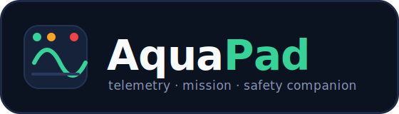
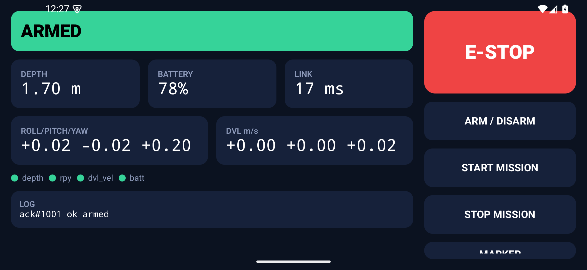
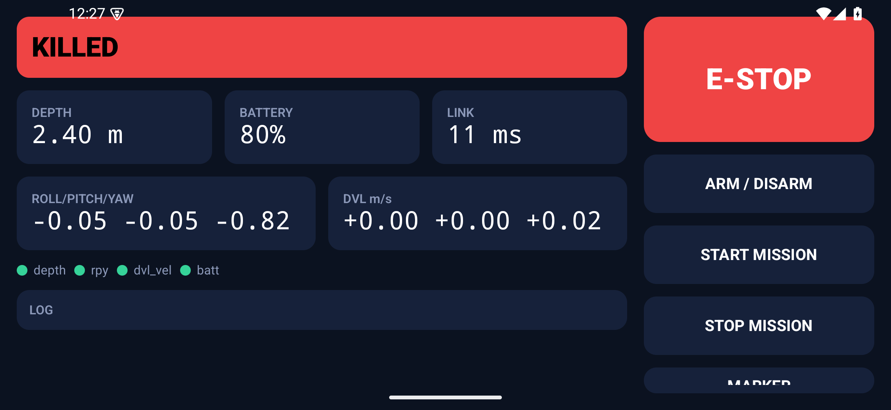

<p align="center">
  
</p>

# AquaPad

Modern field robots are often controlled through a collection of disconnected tools: one
application for telemetry, another for joystick input, another terminal for logs, and
separate mechanisms for emergency stop and safety. During testing, operators frequently
switch between windows just to understand the robot's state or recover from a communication
failure.

AquaPad brings those responsibilities into a single mobile interface. The game controller
(such as a PS5 DualSense) remains the primary driving device, while AquaPad becomes the
telemetry dashboard, mission console, and safety layer around it. It displays live robot
status, sensor health, battery, depth, attitude, and mission information while providing a
software emergency stop and a link-loss deadman that safely reacts if communication with the
operator is interrupted.

Rather than being built for a single robot, AquaPad is profile-driven. All robot-specific
topics, message types, safety configuration, and networking live in a YAML profile, allowing
the same Android app, simulator, and ROS 2 bridge to work across different ROS 2 vehicles
without changing application code. The included [Barracuda](https://github.com/usc-robosub/barracuda_ws)
profile is a production example,
while the generic AUV profile provides a template for new robots.

See [docs/aquapad_bridge.md](docs/aquapad_bridge.md) for the ROS 2 bridge specification.

## Screenshots

The Android app running against the Kotlin simulator — live telemetry over UDP, acked
commands over WebSocket, and the shared safety state machine driving the banner.



*Armed and live: depth, battery, link latency, attitude, DVL, per-sensor health (all green),
and the `arm` command acknowledged in the log.*



*Boots **killed** (fail-safe) until explicitly armed. The big software E-stop and the
link-loss deadman layer on top of the robot's own command-timeout watchdog.*

## Language

**Kotlin is the primary language.** The app, the simulator, and the shared protocol/safety
core are all Kotlin in one Gradle build. Python appears only where it is the right tool: the
ROS 2 bridge (ROS has no production Kotlin client — it runs on the Jetson inside ROS) and a
deliberately language-neutral wire-conformance test.

## Repo layout

```
profiles/      robot definitions (YAML) — the ONLY robot-specific files
protocol/      :protocol — Kotlin: wire messages, JSON codec, profile model, SafetyState
sim/           :sim — Kotlin simulator: stands in for robot + bridge (Ktor + UDP), no ROS
app/           :app — Android app (Kotlin/Compose); reuses :protocol
bridge/        aquapad_bridge.py — config-driven ROS 2 node (Python/rclpy, runs on the Jetson)
tools/         wire_conformance.py — language-neutral protocol test; cli_client.py dev utility
```

The `:protocol` module is shared by the app, the simulator, and (mirrored in Python) the
bridge — so the wire format and the safety state machine can never drift between them.

## What the simulator is

The simulator (`:sim`) is a small Kotlin program that pretends to be the robot, so you can
develop and demo the whole system **without a physical robot, a Jetson, or ROS installed**.

It listens on the same network ports and speaks the same JSON wire protocol the real robot
does. Concretely, it:

- receives the app's heartbeat and commands (`arm`, `mission_start`, `estop`, …),
- runs the **same shared `SafetyState`** the real bridge uses, so arm / E-stop / deadman
  behave exactly as they would on the robot,
- streams back **synthetic but realistic telemetry** — depth gently oscillating, battery
  slowly draining, attitude, DVL velocity, per-sensor health.

Because it reuses the `:protocol` module that the ROS 2 bridge mirrors, anything that works
against the simulator works unchanged against the real robot. The screenshots above are the
Android app talking to this simulator. The `wire_conformance.py` test exercises it the same
way the app does, which is how the safety loop is verified in CI.

## Build & test the Kotlin core (no robot, no Android)

```bash
./gradlew :protocol:test     # unit-tests the SafetyState machine (boot/arm/estop/deadman)
./gradlew :sim:run --args="profiles/barracuda.yaml"   # run the simulator
```

Verify the simulator conforms to the wire protocol (in a second terminal, with the sim running):

```bash
python3 -m venv .venv && source .venv/bin/activate && pip install -r tools/requirements.txt
python3 tools/wire_conformance.py profiles/barracuda.yaml
```

The conformance test asserts the full safety loop end to end: boots **killed** (fail-safe) →
`arm` clears the latch → mission → `estop` latches → **heartbeat-loss deadman** latches. It
is language-neutral, so the same test validates the Kotlin sim *and* the real bridge.

## Build & run the Android app

The app reuses `:protocol`, loads `app/src/main/assets/profiles/barracuda.yaml`, sends
heartbeats + commands over the same protocol, and renders the telemetry HUD. The DualSense
pairs as a standard Bluetooth gamepad; its buttons map to actions via `GamepadMapper`.

It builds from the command line with the Android SDK installed (set `sdk.dir` in
`local.properties`):

```bash
./gradlew :app:assembleDebug    # -> app/build/outputs/apk/debug/app-debug.apk
```

Or open the project in Android Studio (which manages the SDK for you) and run it on a device
or emulator. On the emulator, the app reaches a simulator running on the host at `10.0.2.2`
(already the default `robotHost` in `MainActivity`).

## Running on the Jetson (real robot)

On the real robot, the simulator is replaced by `aquapad_bridge.py` running on the Jetson.
The bridge subscribes the telemetry topics named in the profile, publishes the profile's
kill topic on E-stop / disarm / deadman, and speaks the **exact same wire protocol** the
simulator does — so the phone can't tell the difference between the simulator and the robot.

**Control-authority model.** The DualSense connects **directly to the Jetson** (Bluetooth or
USB) and drives the robot through the ROS 2 control stack. The phone is a *parallel*
telemetry, mission, and safety channel — it is deliberately kept out of the realtime joystick
loop, so losing the phone (dead battery, out of range, app crash) can never strand a moving
robot.

**Prerequisites**
- Jetson with ROS 2 installed and the robot's stack (e.g. Barracuda) running.
- The DualSense paired to the Jetson.
- Phone and Jetson on the same network (the Jetson can also run its own Wi-Fi access point).

**1. Start the bridge on the Jetson** (with ROS 2 sourced):

```bash
source /opt/ros/<distro>/setup.bash       # source your ROS 2 environment
pip install -r bridge/requirements.txt    # rclpy comes from ROS 2, not pip
python3 bridge/aquapad_bridge.py --profile profiles/barracuda.yaml
```

The bridge prints the UDP/WebSocket ports it is listening on (from the profile's `network`
section). Confirm it is publishing the kill topic and reading telemetry:

```bash
ros2 topic echo /barracuda/kill          # should show the boot fail-safe (true) until armed
ros2 topic hz   /aquapad/heartbeat_age   # rises once the phone is connected
```

**2. Point the app at the Jetson.** Set the app's `robotHost` to the Jetson's IP address
(currently the constant `robotHost` in
[`MainActivity.kt`](app/src/main/kotlin/aquapad/app/MainActivity.kt); making it an in-app
setting is a tracked TODO). Rebuild/install and launch — heartbeats start immediately, the
HUD shows live telemetry, and the banner reflects the real `kill_latched` / `armed` state.

**3. Verify the safety loop in the water-side order:** the bridge boots **killed**, `arm`
clears the latch, and if the phone stops sending heartbeats for longer than
`heartbeat_timeout_sec` the bridge latches the kill on its own. Keep that timeout *below* the
thruster node's `cmd_timeout_sec` so the phone path fails first and visibly, with the
hardware watchdog as the backstop.

> No custom bridge yet? For a first bench bring-up you can skip `aquapad_bridge.py` and run
> `rosbridge_server`, having the app talk JSON-over-WebSocket directly to the ROS topics. The
> custom bridge is the upgrade that adds UDP telemetry, the heartbeat deadman, and acked
> commands. See [docs/aquapad_bridge.md](docs/aquapad_bridge.md).

## Safety model (short version)

Hardware kill > software kill > deadman. AquaPad provides the **software kill** (E-stop) and
a **link-loss deadman** (lose the phone → robot zeroes output). The physical latch and the
robot's own command-timeout watchdog remain authoritative underneath. Set each profile's
`heartbeat_timeout_sec` *below* the robot's command-timeout so the phone path fails first
and visibly.
